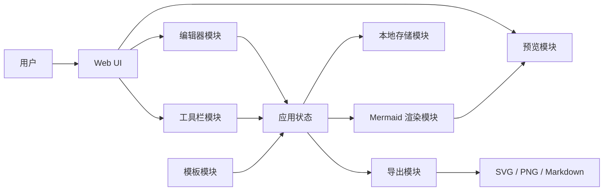

# PixelGraph 架构分析

## 1. 架构目标

PixelGraph 第一阶段的目标是快速落地一个可用的开发者图表生成工具，同时为后续扩展保留空间。

架构设计应满足：

- 快速实现 MVP
- 本地优先，无需后端即可运行
- 图表渲染能力可替换、可扩展
- 编辑器、渲染器、导出器解耦
- 模板和图表类型结构化管理
- 后续可扩展桌面端、VS Code 插件、AI 生成和云端协作

第一阶段建议采用：

```text
前端单页应用 SPA
+
浏览器本地存储
+
Mermaid 渲染引擎
+
导出模块
```

## 2. 整体架构

MVP 阶段不引入后端服务，核心能力全部在浏览器中完成。

整体流程：

```text
用户输入
  ↓
编辑器模块
  ↓
图表语法处理
  ↓
Mermaid 渲染模块
  ↓
预览画布
  ↓
导出模块
```

核心架构图：



## 3. 技术栈建议

### 3.1 前端框架

推荐：

- React
- TypeScript
- Vite

选择原因：

- React 生态成熟
- TypeScript 适合维护复杂数据结构
- Vite 启动快、配置轻
- 适合构建单页工具型应用

### 3.2 图表渲染

推荐：

- Mermaid.js

选择原因：

- 原生支持多种开发常用图表
- 文本化描述方式成熟
- 适合 Markdown 和技术文档场景
- 可以直接生成 SVG
- 社区活跃，学习资料丰富

### 3.3 编辑器

推荐：

- CodeMirror

可选：

- Monaco Editor
- 原生 textarea

建议第一版使用 CodeMirror。它比 textarea 更适合后续实现语法高亮、快捷键、错误定位和自动补全，同时比 Monaco 更轻量。

### 3.4 本地存储

MVP：

- localStorage

后续：

- IndexedDB
- 本地文件导入 / 导出
- SQLite
- 云端数据库

localStorage 适合保存当前草稿、主题、最近使用图表类型等轻量数据。多个图表项目管理可以后续迁移到 IndexedDB。

## 4. 模块划分

推荐目录结构：

```text
src/
  app/
    App.tsx
    routes/
  components/
    EditorPanel/
    PreviewPanel/
    Toolbar/
    TemplatePanel/
    ExportMenu/
  features/
    diagrams/
    editor/
    renderer/
    export/
    storage/
    templates/
    theme/
  shared/
    types/
    utils/
    constants/
```

## 5. 核心模块说明

### 5.1 编辑器模块

职责：

- 展示文本编辑器
- 接收用户输入
- 处理快捷键
- 维护光标和选区状态
- 后续支持语法高亮、自动补全和格式化

核心状态：

```ts
diagramCode: string;
diagramType: DiagramType;
```

### 5.2 图表类型模块

职责：

- 定义支持的图表类型
- 维护图表名称、默认模板、语法类型等元信息
- 为工具栏、模板模块、渲染模块提供统一数据源

图表类型示例：

```ts
type DiagramType =
  | 'er'
  | 'class'
  | 'sequence'
  | 'state'
  | 'flowchart';
```

图表配置示例：

```ts
interface DiagramDefinition {
  id: DiagramType;
  name: string;
  description: string;
  defaultTemplate: string;
}
```

### 5.3 渲染模块

职责：

- 初始化 Mermaid
- 接收 Mermaid 源码
- 渲染 SVG
- 捕获渲染错误
- 管理渲染状态
- 向预览模块输出渲染结果

核心状态：

```ts
type RenderStatus = 'idle' | 'rendering' | 'success' | 'error';

interface RenderResult {
  status: RenderStatus;
  svg: string;
  error: string | null;
}
```

渲染时建议加入防抖，例如用户停止输入 300ms 后再触发渲染，避免频繁调用 Mermaid 阻塞界面。

### 5.4 预览模块

职责：

- 展示 Mermaid 渲染后的 SVG
- 展示渲染错误
- 展示空状态
- 后续支持缩放、拖拽、适配屏幕和全屏预览

第一版建议先实现：

- SVG 展示
- 错误展示
- 重新渲染
- 适配容器宽度

### 5.5 模板模块

职责：

- 维护内置模板
- 按图表类型过滤模板
- 支持用户一键插入模板
- 后续支持用户自定义模板

模板结构示例：

```ts
interface DiagramTemplate {
  id: string;
  type: DiagramType;
  name: string;
  description: string;
  code: string;
}
```

模板数据建议单独维护在：

```text
src/features/templates/templates.ts
```

### 5.6 导出模块

职责：

- 导出 Mermaid 源码
- 导出 Markdown 代码块
- 导出 SVG
- 导出 PNG

导出流程：

```text
当前 Mermaid 源码
  ↓
复制源码 / 生成 Markdown

当前 SVG
  ↓
下载 SVG

当前 SVG
  ↓
转 Canvas
  ↓
下载 PNG
```

导出模块应独立封装，避免和 UI 组件强耦合。

### 5.7 本地存储模块

职责：

- 保存最近编辑内容
- 保存当前图表类型
- 保存主题设置
- 保存编辑器配置
- 后续保存多个图表项目

localStorage key 建议：

```text
pixelgraph:lastDiagramCode
pixelgraph:lastDiagramType
pixelgraph:theme
pixelgraph:editorSettings
```

### 5.8 主题模块

职责：

- 管理浅色 / 深色模式
- 管理图表主题
- 管理 CSS 变量

推荐通过 CSS 变量实现：

```css
:root {
  --bg: #ffffff;
  --text: #111111;
}

[data-theme='dark'] {
  --bg: #111111;
  --text: #f5f5f5;
}
```

## 6. 核心数据流

MVP 数据流：

```text
用户选择图表类型
  ↓
加载对应模板
  ↓
写入编辑器状态
  ↓
用户编辑 Mermaid 文本
  ↓
更新应用状态
  ↓
防抖触发渲染
  ↓
Mermaid 输出 SVG
  ↓
预览区显示 SVG
  ↓
用户点击导出
  ↓
导出模块读取当前源码或 SVG
```

状态管理建议：

- MVP 使用 React useState、useReducer 和自定义 hooks
- 状态变复杂后再考虑 Zustand
- 暂不建议引入 Redux

## 7. 关键架构决策

### 7.1 第一版不做后端

原因：

- 当前核心功能都可以在浏览器完成
- 降低部署和维护成本
- 更符合免费、本地优先的产品定位
- 避免提前引入账号、权限、云存储和协作复杂度

### 7.2 第一版基于 Mermaid

原因：

- 已覆盖 E-R 图、类图、顺序图、状态图、流程图等核心需求
- 文本语法生态成熟
- 适合开发者和 Markdown 文档
- 可以避免第一阶段自研布局引擎

### 7.3 编辑、渲染、导出解耦

原因：

- 后续可以替换编辑器
- 后续可以接入 PlantUML、Graphviz 或自研解析器
- 方便封装成核心 SDK
- 方便复用到桌面端和 VS Code 插件

### 7.4 模板结构化管理

原因：

- 方便维护内置模板
- 方便按图表类型分类
- 方便后续搜索和收藏
- 方便后续扩展用户自定义模板

## 8. 未来扩展架构

当项目从 MVP 进入长期维护阶段，可以逐步演进为多端架构：

```text
PixelGraph Web
PixelGraph Desktop
PixelGraph VS Code Plugin
PixelGraph API Server
```

长期架构示意：

```text
前端应用
  ↓
图表核心 SDK
  ↓
多渲染引擎适配层
  ├─ Mermaid
  ├─ PlantUML
  ├─ Graphviz
  └─ 自研解析器

可选后端
  ├─ 用户系统
  ├─ 云端项目
  ├─ 团队协作
  ├─ AI 生成
  └─ 模板市场
```

后续如需支持多端，可考虑调整为：

```text
packages/
  core/
  web/
  desktop/
  vscode-extension/
```

但 MVP 阶段不建议一开始就引入 monorepo，以免增加工程复杂度。

## 9. 可扩展能力设计

### 9.1 SQL 转 E-R 图

后续可新增 SQL 解析模块：

```text
SQL 输入
  ↓
SQL Parser
  ↓
表结构模型
  ↓
Mermaid ER 图源码
  ↓
渲染
```

### 9.2 代码转类图

后续可新增代码解析模块：

```text
源码输入
  ↓
AST Parser
  ↓
类结构模型
  ↓
Mermaid Class 图源码
  ↓
渲染
```

可优先支持：

- Java
- TypeScript
- Python

### 9.3 AI 辅助生成

后续可新增 AI 生成模块：

```text
自然语言描述
  ↓
AI 生成 Mermaid 源码
  ↓
用户编辑修正
  ↓
图表渲染
```

AI 能力不建议放入 MVP，避免第一阶段引入接口成本、密钥管理和费用问题。

### 9.4 桌面端

后续可基于 Tauri 或 Electron 封装桌面应用。

桌面端可复用：

- 图表核心逻辑
- 模板数据
- 导出逻辑
- 大部分前端 UI

### 9.5 VS Code 插件

后续可将核心能力封装为插件：

- Markdown 中预览图表
- 从代码生成类图
- 从 SQL 生成 E-R 图
- 快速插入模板

## 10. 风险与应对

### 10.1 Mermaid 能力边界

风险：

- Mermaid 对复杂布局的控制能力有限
- 某些图表类型细节可能无法完全满足专业建模需求

应对：

- MVP 接受 Mermaid 的能力边界
- 后续通过渲染引擎适配层接入 PlantUML 或 Graphviz

### 10.2 大图渲染性能

风险：

- 大型图表可能导致浏览器卡顿
- 高频输入触发渲染会影响体验

应对：

- 输入防抖
- 渲染状态提示
- 大图建议拆分
- 后续可引入 Web Worker

### 10.3 导出兼容性

风险：

- SVG 转 PNG 可能存在字体、样式、跨浏览器差异

应对：

- 优先保证 SVG 导出稳定
- PNG 导出增加字体和尺寸处理
- 提供导出失败提示

### 10.4 状态复杂度增长

风险：

- 图表项目、模板、主题、导出设置增多后，组件状态可能变复杂

应对：

- MVP 使用 hooks 管理
- 状态复杂后迁移到 Zustand
- 提前保持模块边界清晰

## 11. MVP 架构结论

PixelGraph 第一版推荐架构：

```text
React + TypeScript + Vite
Mermaid 作为渲染核心
CodeMirror 作为编辑器
localStorage 做轻量本地保存
模块化封装 renderer / exporter / templates / storage
```

第一版优先做好：

- 图表类型切换
- 文本编辑
- 实时预览
- 错误提示
- 模板加载
- SVG 导出
- PNG 导出
- Markdown 导出
- 本地草稿保存

该架构足够轻量，适合快速启动项目，同时不会阻碍后续扩展 SQL 转 E-R、代码转类图、AI 生成、桌面端和 VS Code 插件。

